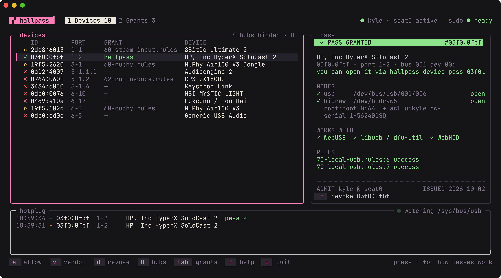
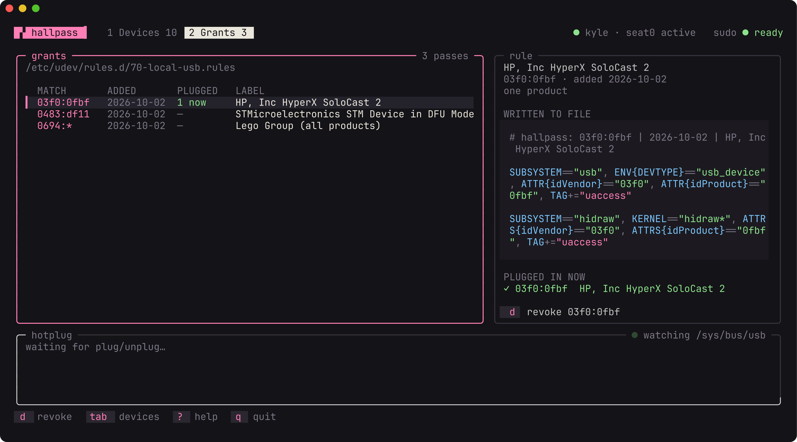

<h1 align="center">hallpass</h1>

<p align="center">
  Give yourself access to USB devices on Linux, without running anything as root.
</p>

<p align="center">
  <a href="https://github.com/gig3m/hallpass/actions/workflows/ci.yml"></a>
  <a href="LICENSE"></a>
  
</p>

<p align="center">
  
</p>

You plug in a dev board, open a browser flasher or a vendor configurator, and get "device not accessible" or "Failed to execute 'open' on 'USBDevice'". The tool runs as you, but the device node is `root:root 0664`, so only root can open it. The fix is a udev rule, and getting it right is fiddly: the file name decides whether it works at all, and when it doesn't, nothing tells you.

hallpass does it for you. Pick the device, press `a`, and it's open. No re-plugging, no group membership, no running your browser as root.

## What it shows

- **Every USB device** with whether you can open it: ✓ open, ◐ only its HID side is open (WebHID works, WebUSB doesn't), ✗ root only.
- **Which rule is responsible**, across `/etc`, `/run` and `/usr/lib/udev/rules.d`, with ⚠ on rules that look right but grant nothing.
- **A pass card** for the selected device: its nodes, who has access, which tools will work (WebUSB, libusb / dfu-util, WebHID), and the rules that mention it.
- **Live hotplug**, so a device that drops off the bus while switching into bootloader mode is obvious.

<p align="center">
  
</p>

<p align="center">
  
</p>

The Grants tab lists your passes and the exact lines hallpass wrote for each.

## Install

```sh
go install github.com/gig3m/hallpass@latest
```

or from a checkout:

```sh
go build -o ~/.local/bin/hallpass .
```

Linux with systemd-logind (that's what turns `uaccess` into access). Needs `udevadm`, `setfacl` from the `acl` package, and `sudo`.

## Usage

Run it as yourself. hallpass calls `sudo` on its own for the one step that needs root, and refuses to run as root, since root can open everything and the status column would be meaningless.

```
hallpass                      interactive TUI
hallpass list                 connected devices and whether you can open them
hallpass rules                current passes
hallpass allow VID[:PID]      pass for one device, or a whole vendor without :PID
hallpass revoke VID[:PID|*]   remove a pass
```

| Key | |
|---|---|
| `a` | allow the selected device |
| `v` | allow every product from its vendor |
| `d` | revoke |
| `H` | show or hide hubs |
| `tab`, `1`, `2` | switch tabs |
| `r` | rescan |
| `?` | help |
| `q` | quit |

Rows and tabs are clickable. If sudo wants a password, hallpass asks in its own prompt, and the apply dialog shows each step as it happens.

## How it works

- **One file.** Passes live in `/etc/udev/rules.d/70-local-usb.rules`. Each one tags the device's raw USB node and its hidraw nodes with `uaccess`, and logind gives the user at the active seat an ACL on them. Nobody gets added to a group, and access follows whoever is logged in at the machine.
- **Numbered `70-` on purpose.** `uaccess` only takes effect in a file that sorts before `73-seat-late.rules`. A `99-mydevice.rules` with `TAG+="uaccess"` still tags the device but grants nothing, with no warning. hallpass marks rules like that with ⚠.
- **Applies immediately.** After writing the file it reloads udev and retriggers the matching devices, so access changes without a re-plug.
- **Revoke really revokes.** udev never removes an ACL it added, so hallpass strips it from connected devices first, then retriggers. If some other rule still grants access, the retrigger puts it back.
- **Vendor passes** are for devices that change product ID between modes. A LEGO hub is `0694:0009` normally and `0694:0008` in its bootloader, and a flasher needs both. The USB line matches with `ATTR`, not `ATTRS`, so a vendor pass for a hub doesn't spread to everything plugged into it.

## License

[MIT](LICENSE)
